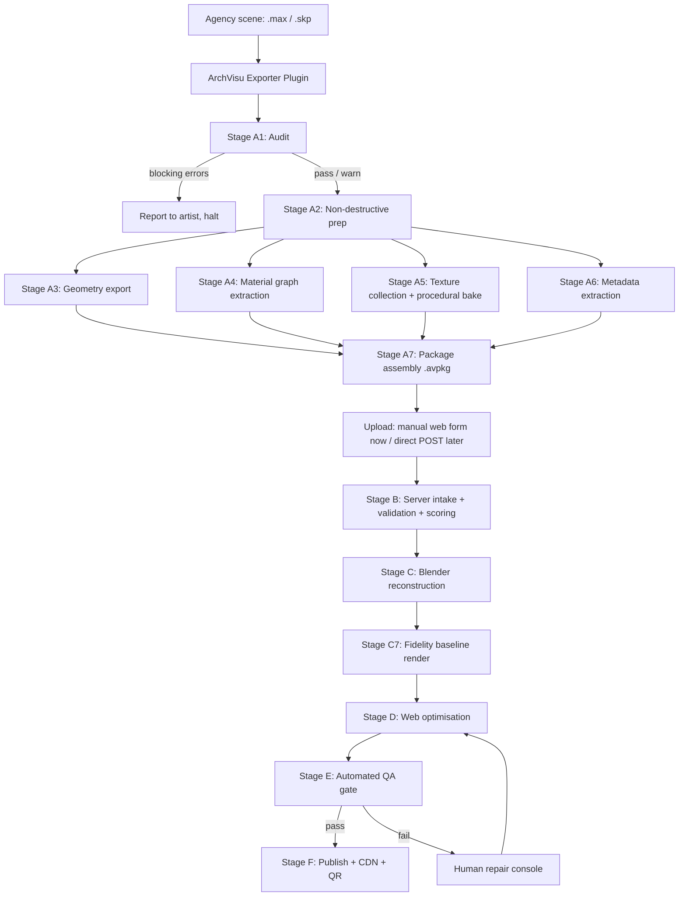
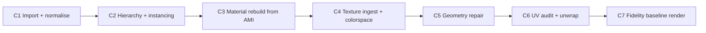

# ArchVisu Conversion Pipeline — Technical Specification v0.1

**Scope:** 3ds Max / SketchUp → agency-side export package → Blender reconstruction → web-optimised GLB → hosted walkthrough.

**Design principle:** every stage is *idempotent*, *content-addressed*, and *instrumented*. A stage must be re-runnable without re-running the ones before it. This is what makes debugging tractable and what makes re-delivery (client wants a change) cheap.

---

## 0. Top-level flow



---

# PART A — AGENCY-SIDE EXPORT

The exporter is a plugin, not a document of instructions. Instructions get ignored; plugins get run. Two implementations sharing one output contract:

- **3ds Max:** MaxScript / .NET plugin, `.mzp` installer, dockable rollout.
- **SketchUp:** Ruby extension, `.rbz` installer, toolbar button.

Both emit the identical `.avpkg` structure so everything downstream is source-agnostic.

---

## Stage A1 — Scene Audit (runs first, always)

Read-only pass. Produces `audit.json` and an in-app report. **This ships as a standalone free tool before the exporter exists** — it is your foot in the door.

### What it checks

| Check | Max implementation | SketchUp implementation | Severity |
|---|---|---|---|
| Missing texture files | `ATSOps.RefreshWithDependencies` then `ATSOps.GetFiles` → filter status `#missing` | `model.materials.each { \|m\| m.texture&.filename }` → verify on disk | **BLOCK** |
| Unsupported renderer materials | `getClassInstances()` walk, compare against known-class whitelist | n/a (SU has one material type) | WARN |
| Total triangle count | `sum (getPolygonCount o)[2]` over geometry | `entities.grep(Sketchup::Face).count` × est. | WARN >5M, BLOCK >50M |
| Objects with no UVs | `meshop.getNumMapVerts o 1` == 0 | n/a (SU auto-UVs) | WARN |
| Non-uniform / negative scale | inspect `o.transform` determinant < 0 | check `transformation.xaxis` cross products | WARN |
| Unwelded / open geometry | `meshop.getOpenEdges` count ratio | `edges.select { \|e\| e.faces.count == 1 }` | WARN |
| Reversed faces | normal vs. centroid-outward heuristic | `face.material` nil but `face.back_material` set → strong signal | WARN |
| Proxy / external refs | `getClassInstances VRayProxy`, `xrefs.getXRefFileCount()` | `model.definitions.select(&:image?)` | **BLOCK** |
| Scatter systems | `getClassInstances Forest_Pack` / RailClone | n/a | **BLOCK** |
| Scene extents / origin offset | `nodeGetBoundingBox` union, distance from origin | `model.bounds.center` | WARN >10km |
| Units set | `units.SystemType`, `units.SystemScale` | `model.options["UnitsOptions"]["LengthUnit"]` | **BLOCK** if unset |
| Textures >4K | bitmap header read | texture `.image_width` | WARN |
| Duplicate/overlapping coplanar faces (z-fighting source) | spatial hash of face centroids + normals | same | WARN |

### Failure modes at this stage

- **`ATSOps` is unreliable on network paths.** UNC paths (`\\server\textures\`) resolve inconsistently depending on mapped drives. Mitigation: run a secondary check via direct `doesFileExist` on each resolved path and report the *resolved absolute path* in the report so the artist can see exactly what's broken.
- **Audit is slow on huge scenes.** A 40M-tri scene with 3000 materials can take minutes. Mitigation: run the audit on a background thread with a progress bar, and short-circuit on the first BLOCK-class error.
- **The artist ignores warnings.** Mitigation: warnings are recorded into `audit.json` and travel with the package. When something looks wrong downstream you can point at it: "your scene had 412 reversed faces, we flagged it."

---

## Stage A2 — Non-Destructive Preparation

**Critical rule: never modify the artist's saved file.** Everything happens on an in-memory copy or in a `hold`/`undo` transaction that is rolled back after export.

**Max:** wrap in `undo on ( ... )` plus `holdMaxFile()` / `fetchMaxFile()` as a hard safety net. Better: `saveMaxFile tempPath` → operate → `loadMaxFile originalPath` at the end. Slow but bulletproof, and artists forgive slow far more readily than they forgive a corrupted file.

**SketchUp:** `model.start_operation("ArchVisu Export", true)` → work → `model.abort_operation` after export completes.

### Operations performed

1. **Resolve proxies to mesh.** `VRayProxy` objects hold `.vrmesh` on disk that FBX will not carry. Convert to editable mesh at preview-quality resolution, or export the `.vrmesh` alongside and convert server-side (`ply2vrmesh` has an inverse; realistically, mesh them here).
2. **Resolve scatter to instances.** Forest Pack has a "Convert to Instances/Meshes" path. RailClone similarly. **This is the single most dangerous step** — a Forest Pack object representing 200,000 trees becomes 200,000 real objects and Max dies. Mitigation: read the scatter object's estimated instance count *first*, and if it exceeds a threshold, export the scatter as **transform data only** (positions + rotations + scales + source object ID) into the manifest, and export the source object once. You reconstruct instancing in Blender. This is strictly better than meshing it anyway.
3. **Collapse modifier stacks** on a copy — but preserve custom normals first (see A3).
4. **Flatten XRefs** — `xrefs.mergeXRefFile`.
5. **Assign stable UUIDs.** Every node gets a persistent GUID written to a custom attribute / `Sketchup::Entity#set_attribute("archvisu", "uid", ...)`. This is the join key between the geometry file and the manifest. **Do not rely on names** — names are non-unique, get mangled by FBX, and contain Unicode that breaks tooling.
6. **Freeze transforms** where safe; record the original matrix in the manifest regardless.

### Failure modes

- **Proxy meshing explodes memory.** Mitigation: threshold check + fall back to transform-only export.
- **Undo transaction fails on a 20GB scene**, leaving the artist's file modified. Mitigation: the save-temp/reload-original approach, plus an explicit "we will reload your file after export" warning in the UI.
- **UUID attributes don't survive** SketchUp's `make_unique` on components. Mitigation: write UUIDs to the definition *and* the instance, and reconcile server-side.

---

## Stage A3 — Geometry Export

Multi-lane. The exporter picks a lane by capability detection and can emit more than one.

### 3ds Max

**Primary: FBX 2020 binary.**

```
FBXExporterSetParam "Animation" false
FBXExporterSetParam "Cameras" true
FBXExporterSetParam "Lights" true
FBXExporterSetParam "SmoothingGroups" true      -- critical
FBXExporterSetParam "NormalsPerPoly" false
FBXExporterSetParam "TangentSpaceExport" true
FBXExporterSetParam "PreserveInstances" true    -- critical
FBXExporterSetParam "Triangulate" false         -- let Blender do it
FBXExporterSetParam "EmbedTextures" false       -- we ship them separately
FBXExporterSetParam "UpAxis" "Z"
FBXExporterSetParam "FileVersion" "FBX202000"
FBXExporterSetParam "ConvertUnit" "cm"
FBXExporterSetParam "GeomAsBone" false
```

**Secondary (Max 2023+): USD.** `USDExporter` preserves hierarchy, point instancing, and MaterialX far better than FBX. Emit both when available — USD is your high-fidelity lane, FBX is your compatibility lane.

**Tertiary for heavy scenes: Alembic.** Best-in-class for dense geometry + instancing, zero materials (which is fine, materials come from the manifest anyway).

### SketchUp

**Primary: COLLADA (.dae)** via `model.export`, options:
```ruby
{
  :triangulated_faces   => false,
  :doublesided_faces    => false,   # handle back-faces explicitly instead
  :edges                => false,
  :author_attribution   => false,
  :texture_maps         => true,
  :selectionset_only    => false,
  :preserve_instancing  => true     # critical — SU components → DAE instances
}
```
SketchUp's DAE exporter preserves component hierarchy and instancing better than its FBX exporter, which flattens aggressively.

**Secondary: glTF** via extension, useful as a cross-check.

### Why not just glTF from the source?

Because the source-app glTF exporters are the weakest link in both DCCs — they lose instancing, mangle hierarchy, and pre-bake decisions you want to make yourself. glTF is your *output* format, not your interchange format. Keep those roles separate.

### Failure modes

- **`bake_space_transform` / up-axis mismatch.** The classic. Max is Z-up, glTF is Y-up, Blender is Z-up, SketchUp is Z-up-inches. Every conversion is a chance to introduce a 90° rotation. Mitigation: export with a known explicit up-axis, **record it in the manifest**, and place a 1m×2m×3m asymmetric "orientation probe" cube at world origin in a debug export lane so misorientation is instantly visible in an automated check.
- **FBX silently drops custom split normals** when smoothing groups are off. Mitigation: assert `SmoothingGroups=true`, and verify post-export by re-importing the FBX header in the plugin.
- **Instancing is lost** despite `PreserveInstances` when objects have differing modifier stacks. Mitigation: record instance groups explicitly in the manifest via `InstanceMgr.GetInstances` and rebuild in Blender from that, treating FBX instancing as a bonus not a guarantee.
- **Unicode / long paths.** Max on Windows with a Devanagari or Cyrillic object name → FBX writes it, Blender's importer chokes or mangles. Mitigation: UUID-based naming in the export, human names only in the manifest as UTF-8 JSON.
- **>2GB FBX.** Binary FBX has practical limits and importers get flaky. Mitigation: split by layer/floor into multiple FBX parts, listed in the manifest.

---

## Stage A4 — Material Graph Extraction → AMI

This is the highest-value part of the whole system and the part FBX cannot do for you.

**AMI = ArchVisu Material Interchange.** A strict, renderer-agnostic, metal-rough PBR schema. Every source material is *translated* into it by a hand-authored, per-class mapping table.

### Extraction method

**Max:** enumerate `sceneMaterials` plus `getClassInstances()` for each supported class, then recursively walk sub-materials and map slots via `getSubTexmap` / `getNumSubTexmaps`.

### Translation table (the core IP)

| Source | AMI field | Conversion notes |
|---|---|---|
| `VRayMtl.diffuse` / `.texmap_diffuse` | `baseColor` / `baseColorTexture` | sRGB |
| `VRayMtl.reflection_glossiness` | `roughness` | `roughness = 1 - glossiness` **only if** `.brdf_type` is GGX; Blinn/Phong need a different curve |
| `VRayMtl.reflection` (colour) | `metallic` / `specular` | If reflection colour ≈ diffuse colour and `.reflection_fresnel == false` → likely metal, set `metallic=1`. Otherwise dielectric, derive `specular` from `.reflection_ior` |
| `VRayMtl.refraction` + `.refraction_ior` | `transmission`, `ior` | → `KHR_materials_transmission` + `KHR_materials_ior` |
| `VRayMtl.refraction_fog_color/multiplier` | `attenuationColor`, `attenuationDistance` | → `KHR_materials_volume` |
| `VRayMtl.texmap_bump` + `.bump_multiplier` | `normalTexture` + `scale` | **Detect bump-vs-normal**: sample the map; if it's near-greyscale it's a height map and must be converted to a normal map server-side |
| `VRayMtl.texmap_displacement` | `heightTexture` | Cannot ship to web. Either bake to normal or drop — flag it |
| `VRayBlendMtl` | layered material | Blend by mask → either bake to a single flattened texture set, or emit two materials + vertex mask |
| `VRay2SidedMtl` | `thin` + `transmission` | Approximate; curtains/leaves |
| `VRayLightMtl` | `emissive` + `KHR_materials_emissive_strength` | Multiplier > 1 needs the extension |
| `CoronaPhysicalMtl` | direct metal-rough map | Nearly 1:1, easiest case |
| `PhysicalMaterial` | direct metal-rough map | 1:1 |
| `Standardmaterial` (legacy) | approximate | `roughness ≈ 1 - (glossiness/100)`, no metalness. Flag as low-confidence |

**Every mapping carries a `confidence` score.** Low-confidence materials get surfaced in the human repair console rather than silently shipping wrong.

### UV transform capture

Per texture slot, record: `mapChannel`, `u_offset`, `v_offset`, `u_tiling`, `v_tiling`, `w_angle`, and crucially **`realWorldScale`** with the real-world width/height in scene units. Real-world-scale mapping is extremely common in arch-viz and is the #1 cause of "the tiles came out the wrong size." → maps to `KHR_texture_transform`.

### SketchUp

SketchUp materials are diffuse colour + optional texture + alpha. That's it. So the extraction is trivial but the **enrichment** is where the work is:

1. Record `material.color`, `material.alpha`, `material.texture.filename`, and `texture.width`/`texture.height` **in model units** — these give you the real-world tiling directly.
2. Record `face.material` vs `face.back_material` per face-group — SketchUp's two-sided materials have no glTF equivalent and need an explicit decision.
3. **PBR upgrade:** match each texture against a curated PBR library. Two-stage matcher: (a) filename/keyword tokens (`oak`, `travertine`, `brushed_steel`), (b) image-embedding nearest-neighbour against library albedos. Above a similarity threshold, substitute the full material set (albedo/normal/roughness/AO); below it, synthesise a plausible roughness from albedo luminance and flag low confidence.

This is a genuine product differentiator: your SketchUp output looks *better* than the source, not merely equivalent.

### Failure modes

- **Unknown material class** (a plugin material, an OSL shader, a custom Corona setup). Mitigation: fallback path that uses `getSubTexmap` on the first slot and renders the material to a sphere preview via `renderMap()` for the repair console to eyeball. Never fail the job — degrade.
- **Procedural maps** (Noise, Tiles, Falloff, Gradient Ramp, Cellular) have no texture file. Mitigation: bake with `renderMap map size:[1024,1024]` during export. **Caveat:** 3D procedurals (Noise in world space, Cellular) do not bake correctly to a 2D UV map without valid UVs — check UVs first, and if absent, bake to a flat approximation and flag.
- **Falloff maps used for fresnel** are extremely common and are semantically "just fresnel" — detect the `Falloff` type field and map to the Principled fresnel rather than baking a weird texture.
- **Colour-space ambiguity.** Roughness/metal/normal maps must be linear; albedo/emissive must be sRGB. Max's bitmap gamma settings are per-file and frequently wrong. Mitigation: infer from *slot* not from file (a map plugged into roughness is linear, period) and record it explicitly.

---

## Stage A5 — Texture Collection

1. Resolve every path to absolute.
2. **Hash each file (SHA-256)**, rename to `<hash>.<ext>`, dedupe. Arch scenes reuse textures heavily — 30–60% dedup rates are normal.
3. Convert exotic formats (`.tx`, `.tif` 16-bit, `.exr`, `.psd`, `.rla`) to PNG/JPEG. `.psd` in particular is common in Max and unreadable downstream.
4. Record original dimensions, bit depth, and whether alpha is present *and non-trivial* (fully-opaque alpha channels waste enormous bandwidth — strip them).
5. Optionally downsample >4K at source to cut upload size, keeping the original hash recorded.

### Failure modes

- **Texture is a `.max` bitmap with a proxy resolution** — Max keeps low-res proxies; ensure you grab the source.
- **Missing textures despite the audit** because the artist relinked between audit and export. Mitigation: re-verify at collection time.
- **Total texture payload is 8GB.** Real. A 200-material scene with 8K maps. Mitigation: pre-upload downsampling with a clearly-stated policy, and a size report in the plugin UI before the artist commits.

---

## Stage A6 — Metadata Extraction

Everything that isn't geometry or materials, and all of it is UX gold:

| Data | Max | SketchUp | Downstream use |
|---|---|---|---|
| Saved cameras | `getClassInstances Camera` — position, target, FOV | `model.pages.each { \|p\| p.camera }` | **Auto-generate the guided tour path** |
| Layers / tags | `LayerManager` | `model.layers` | Room/floor detection, visibility toggles |
| Units + system scale | `units.SystemScale/SystemType` | `model.options["UnitsOptions"]` | Correct scale in Blender |
| Geolocation | scene north + `getLocation` | `model.shadow_info["Latitude"/"Longitude"/"North"]` | **Real sun-path simulation** in the viewer |
| Section planes | section objects | `model.entities.grep(Sketchup::SectionPlane)` | Cutaway views |
| Lights | `getClassInstances light` + intensity/colour/temp | `shadow_info` only | Lighting bake setup |
| Scene bounds + origin offset | bounding box union | `model.bounds` | Precision handling, chunking |
| Object metadata / IFC-ish attrs | custom attributes, object properties | `entity.attribute_dictionaries` | Hotspot spec cards |

**The saved cameras are the highest-leverage item in this table.** Architects already composed their best views. You get a professional camera path for free.

---

## Stage A7 — Package Assembly (`.avpkg`)

A zip with a fixed, versioned layout:

```
project_<uuid>.avpkg
├── manifest.json              # schema-versioned root document
├── audit.json                 # A1 output, warnings included
├── geometry/
│   ├── scene.fbx              # or scene_part01.fbx, scene_part02.fbx …
│   ├── scene.usd              # optional high-fidelity lane
│   └── scene.abc              # optional heavy-geo lane
├── materials/
│   └── materials.ami.json     # AMI array, keyed by material UUID
├── textures/
│   ├── <sha256>.png
│   ├── <sha256>.jpg
│   └── textures.index.json    # hash → original path, colorspace, dims, slot usage
├── baked/
│   └── <sha256>.png           # procedurals baked in A4
├── metadata/
│   ├── cameras.json
│   ├── layers.json
│   ├── instancing.json        # scatter transforms, instance groups
│   ├── geo.json               # lat/long/north
│   └── lights.json
├── preview/
│   ├── viewport_<n>.jpg       # 6–12 viewport captures from saved cameras
│   └── material_<uuid>.jpg    # renderMap sphere previews
└── checksums.sha256
```

### `manifest.json` root fields

```jsonc
{
  "schemaVersion": "1.0.0",
  "packageId": "uuid",
  "source": {
    "app": "3dsmax", "version": "2024.2",
    "renderer": "vray", "rendererVersion": "6.2",
    "plugin": "archvisu-exporter 0.4.1"
  },
  "scene": {
    "upAxis": "Z", "unitScale": 1.0, "unitType": "cm",
    "boundsMin": [...], "boundsMax": [...],
    "originOffset": [...], "triangleCount": 4820391
  },
  "nodes": [ { "uid": "...", "name": "...", "parent": "...",
               "matrix": [16 floats], "materialUid": "...",
               "instanceGroup": "...", "layer": "..." } ],
  "exportLanes": ["fbx", "usd"],
  "auditSummary": { "blocking": 0, "warnings": 12 }
}
```

**Why the `preview/` folder matters:** those viewport captures are your ground truth for the automated visual QA in Stage E. Without a reference image from the artist's machine, you have nothing to compare against.

---

## Stage A8 — Upload

**Now:** artist clicks "Save Package", gets `project_<uuid>.avpkg`, uploads via web form.

**Design the manual path so the automated path is a one-line change** — the plugin already produced the exact bytes; direct upload is just a `POST` with a resumable/multipart client. Build the intake API first and let the web form call the same endpoint.

**Do this from day one even in manual mode:** chunked upload with resume. `.avpkg` files will routinely be 2–15GB and Indian office upload links drop. A failed 9GB upload at 94% will cost you a customer.

---

# PART B — SERVER INTAKE

### B1 — Verify
Unzip to content-addressed storage → verify `checksums.sha256` → validate `manifest.json` against the JSON schema for its declared `schemaVersion` → verify every referenced texture hash exists → verify every `materialUid` in `nodes` resolves in `materials.ami.json`.

Reject fast and specifically. "Missing texture `a3f9…` referenced by material 'Glass_Frosted'" beats "invalid package."

### B2 — Complexity scoring
Compute a deterministic score from triangle count, material count, unique texture bytes, node count, transparent-material count, and built-up area. Score → pricing tier → compute budget → SLA. Because it's automated, quoting is instant and non-negotiable, which kills a whole category of sales friction.

### B3 — Job graph
Build a DAG of stages. Each stage's output is keyed by `hash(stage_code_version + input_hashes + params)`. A re-run after a material tweak reuses the geometry cache. This turns "client wants the sofa in blue" from a 4-hour rebuild into a 6-minute one, which is a margin issue, not a convenience issue.

---

# PART C — BLENDER RECONSTRUCTION

Headless `bpy` as a Python module in a container. **Never `bpy.ops` where a direct data-API call exists** — operators depend on context, are slow, and behave differently headless.



## C1 — Import & Normalisation

```python
bpy.ops.import_scene.fbx(
    filepath=fbx_path,
    use_custom_normals=True,
    use_image_search=False,        # we bind textures ourselves
    bake_space_transform=False,    # leave geometry alone; fix at export
    use_anim=False,
    ignore_leaf_bones=True,
    automatic_bone_orientation=False,
    global_scale=1.0,
)
scene.unit_settings.system = 'METRIC'
scene.unit_settings.scale_length = manifest['scene']['unitScale']
```

**`bake_space_transform=False` is deliberate.** It rewrites object matrices to "fix" axis conventions and is a notorious source of rotated/mirrored objects with non-uniform scale. Import raw, apply one known global transform at the end.

**Origin offset:** if the scene sits 40km from origin (survey-coordinate SketchUp models do this constantly), single-precision float in WebGL will produce visible vertex jitter. Detect from `boundsMin/Max`, subtract a global offset, and record it so georeferencing still works.

**Problems:** FBX importer version drift between Blender releases changes behaviour subtly — **pin the Blender version per pipeline release** and treat a Blender upgrade as a code change requiring regression tests against a corpus of reference packages.

## C2 — Hierarchy & Instancing Rebuild

Match imported objects to `manifest.nodes` by UUID (custom property survives FBX as a user property; fall back to name-normalisation). Rebuild parenting. Rebuild instancing from `instancing.json`:

- Instance groups → linked object data (`obj.data = source.data`).
- Scatter transforms → a single mesh with a `GeometryNodes` instance-on-points setup, or direct linked duplicates. → exports to `EXT_mesh_gpu_instancing`.

**Problem:** instancing and mesh-joining are in direct tension. Joining reduces draw calls; instancing reduces memory and vertex count. The right answer is per-object and depends on instance count — below ~8 instances, join; above, instance. Make that a tunable and measure it.

## C3 — Material Reconstruction

AMI → Principled BSDF node graphs, **constrained to the glTF-exportable subset**. If a value can't survive glTF export, either bake it now or drop it deliberately with a log entry. Never let the exporter silently discard things.

Exportable: base colour, metallic, roughness, normal, occlusion, emission (+ strength), alpha (blend/mask/opaque), transmission, IOR, specular, clearcoat, sheen, volume/attenuation, anisotropy, texture transform.

**Alpha mode decision:** this needs real logic, not a default. Fully-opaque alpha channel → `OPAQUE` (strip the channel). Binary alpha (foliage cutouts, cut-out people) → `MASK` with a computed cutoff. Genuinely graded alpha (glass, sheer curtains) → `BLEND`, and accept the sorting problem. Getting this wrong is the #1 cause of "the render looks broken" — `BLEND` on foliage produces sorting artifacts that look catastrophic.

**Bump→normal conversion:** for slots flagged as height maps, generate a normal map (Sobel on the height, scaled by the bump multiplier) rather than shipping a height map the web viewer can't use.

## C4 — Texture Ingest

Bind by hash. Set `image.colorspace_settings.name` explicitly from `textures.index.json` — `'sRGB'` for albedo/emissive, `'Non-Color'` for everything else. Apply `KHR_texture_transform`-equivalent mapping nodes from the recorded UV transforms, converting real-world-scale into UV tiling using the object's actual dimensions.

**Problem:** real-world-scale conversion requires knowing the object's UV-space-to-world-space ratio, which varies per face if UVs are non-uniform. Mitigation: compute per-object average texel density and use it; flag high-variance objects.

## C5 — Geometry Repair

Ordered, and the order matters:

1. **Degenerate removal** — zero-area faces, zero-length edges. `bmesh.ops.dissolve_degenerate(bm, dist=scale_relative_epsilon)`.
2. **Loose geometry** — verts/edges with no faces. Common from CAD imports.
3. **Merge by distance** — `bmesh.ops.remove_doubles(bm, verts=bm.verts, dist=…)`. **Tolerance must be derived from scene scale**, not hardcoded. A 1mm tolerance destroys a piece of jewellery and does nothing to a masterplan. Use `bounds_diagonal * 1e-5`, clamped.
4. **Normal recalculation** — `bmesh.ops.recalc_face_normals`. For SketchUp, use the `back_material` signal from A4: if a face-group is predominantly back-material-assigned, flip it. Pure geometric outward-facing heuristics fail on interior architecture because "outward" is ambiguous inside a closed room.
5. **Custom split normals** — preserve from FBX smoothing groups. Do **not** run auto-smooth over imported custom normals; it destroys the artist's intent on curved surfaces.
6. **Interior face culling** — optional, aggressive. Ray-cast from an exterior shell to identify never-visible faces. High risk on interior walkthroughs; enable only for exterior-only deliverables.
7. **N-gon triangulation** — deferred until after decimation, because planar decimation *wants* n-gons.

**Problems:**
- Merge-by-distance welds across a UV seam and creates a texture smear. Mitigation: `bmesh.ops.remove_doubles` doesn't respect UV islands — split-normals and UVs must be re-validated after, or use a UV-aware weld.
- CAD-origin geometry is frequently non-manifold in ways that are *correct* for rendering but break every repair heuristic. Don't over-repair. Measure whether a repair improved the QA score; if not, skip it.

## C6 — UV Audit & Unwrap

- Detect missing UV layers per object.
- Detect overlapping UV islands (fine for albedo tiling, **fatal for lightmap baking**).
- Generate a **second UV channel** for lightmaps/AO with guaranteed non-overlapping islands. Use `xatlas` (via `xatlas-python`) rather than Blender's `smart_project` + `lightmap_pack` — xatlas produces materially better packing and is what every game engine uses. Island margin must account for the lightmap resolution's mip levels or you get light bleeding between islands.

**Problem:** unwrapping a 4M-triangle building is slow (minutes to tens of minutes) and is usually your longest single stage. Mitigation: unwrap per spatial chunk in parallel, and skip unwrapping for objects that will only receive probe lighting rather than a lightmap.

## C7 — Fidelity Baseline Render

**Before any optimisation**, render the scene from the manifest's saved cameras with Cycles at modest samples. Store as `baseline_<cam>.png`.

This is the reference for Stage E. Everything after this point degrades the model; you need to know by how much. Also compare against the artist's `preview/viewport_*.jpg` — a large delta here means the *reconstruction* is wrong, which is a fundamentally different bug from the *optimisation* being too aggressive. Separating those two failure classes is essential and most pipelines conflate them.

---

# PART D — WEB OPTIMISATION

## D1 — Polygon Reduction

**Two passes, in this order:**

1. **Planar / dissolve decimation first.** `modifier_type='DECIMATE'`, `decimate_type='DISSOLVE'`, `angle_limit≈radians(1–5°)`, `delimit={'UV','MATERIAL','SHARP'}`. Architectural geometry is dominated by coplanar triangles — walls, slabs, glazing, floors. This routinely removes 40–70% of triangles **with zero visual change**. Skipping it and jumping to quadric collapse is why most conversions look melted.
2. **Quadric collapse second**, per-object ratio driven by the object's screen-space contribution (projected bounding-box area across the camera path), with boundary and UV preservation on.

**Do not decimate:** low-poly objects (already cheap), objects with a high curvature-to-triangle ratio (spheres, mouldings), or anything whose silhouette dominates a hero shot.

## D2 — Spatial Partitioning

Arch models are natively **cell-and-portal**. Exploit it:

1. Detect floors: faces with normal ≈ +Z, area above threshold, clustered by Z height → floor levels.
2. Detect rooms: 2D occupancy grid per floor from wall geometry → flood fill → connected components = cells. Doorways/openings = portals.
3. Fall back to layer names (`GF_LivingRoom`) from `layers.json` when they're meaningful, and to k-means spatial clustering when they're not.

Output: a cell graph with portal adjacency. The viewer loads the current cell + cells reachable through one portal. This beats generic frustum culling dramatically in interiors, where frustum culling fails because a wall 2m away occludes the entire rest of the building but is still "in frustum."

**Problem:** open-plan and double-height spaces defeat naive cell detection. Mitigation: merge cells below a volume threshold, cap cell count, and allow manual override in the repair console.

## D3 — LOD Generation (three orthogonal axes)

| Axis | Mechanism | Trigger |
|---|---|---|
| **Geometric** | 3–4 decimation levels per object | Distance / screen coverage |
| **Texture** | KTX2 mip levels streamed independently | Distance + available VRAM |
| **Spatial** | Which cells are resident at all | Cell graph + user position |

Bundle output as: **L0** = exterior shell + entry-node 360 pano (target <3MB, first frame in ~2s). **L1** = walkable geometry for the current cell + immediate neighbours. **L2** = full detail + high-res textures, streamed on idle.

## D4 — Lighting Bake

Highest-cost stage, highest visual payoff.

- **Tier 1 (cheap):** AO map bake only + a simple sky/HDRI in the viewer. Cheap COGS, acceptable quality. **Start here.**
- **Tier 2:** Full indirect lightmap bake to UV2, Cycles GPU, denoised (OptiX). Bake 2–3 lighting states (day / evening / night) as separate lightmap sets and cross-fade in the viewer — enormous perceived value for a linear increase in bake cost.
- **Tier 3:** Irradiance volumes / light probes for dynamic or moveable objects, combined with static lightmaps.

**Problems:**
- Bake time is your dominant COGS and it scales with lightmap texel count, not triangle count. Budget texels per square metre of *floor area*, not per object.
- Lightmap seams at UV island boundaries. Mitigation: adequate island margin + a dilation/padding pass after bake.
- Bake noise on interiors with small light apertures — the classic arch-viz sampling problem. Mitigation: portal lights / explicit sampling hints, higher samples for interior cells only.
- Emissive materials and glass in the bake path can produce fireflies. Clamp indirect.

## D5 — Texture Optimisation

Post-process with `gltf-transform` (Node CLI) — Blender's exporter doesn't do KTX2 natively:

```
gltf-transform dedup      in.glb tmp.glb
gltf-transform prune      tmp.glb tmp2.glb
gltf-transform resize     tmp2.glb tmp3.glb --width 2048 --height 2048
gltf-transform uastc      tmp3.glb tmp4.glb --slots "{normalTexture,metallicRoughnessTexture}" --level 4 --rdo 4
gltf-transform etc1s      tmp4.glb tmp5.glb --slots "{baseColorTexture,emissiveTexture}" --quality 200
gltf-transform meshopt    tmp5.glb out.glb --level high
```

- **UASTC for normal/ORM** (block artifacts in normals are very visible), **ETC1S for albedo** (4–8× smaller).
- **Resize by screen contribution**, not uniformly — a 4K map on a ceiling nobody looks at is pure waste.
- **Atlas cautiously.** Atlasing reduces draw calls but breaks tiling — a wall using a 2×2m tiled tile texture cannot be atlased without baking the tiling into geometry-scale UVs, which explodes texture size. Atlas only non-tiling materials.

## D6 — Draw Call Reduction

The real web bottleneck is usually draw calls and texture memory, **not** triangles. A 500k-tri model with 2000 draw calls performs far worse than a 3M-tri model with 80.

- Join objects sharing a material *within the same spatial cell* (never across cells — it destroys culling).
- Use `gltf-transform palette` to merge many single-colour materials into one palette texture — arch scenes are full of these.
- Keep instancing for high-count repeats.
- **Target: <150 draw calls per resident cell on mobile.**

## D7 — glTF Export

```python
bpy.ops.export_scene.gltf(
    export_format='GLB',
    export_apply=True,
    export_texcoords=True, export_normals=True,
    export_tangents=False,          # let the viewer derive; saves bytes
    export_materials='EXPORT',
    export_image_format='AUTO',
    export_yup=True,                # single, known, final axis conversion
    export_cameras=True,
    export_extras=True,             # carries hotspot metadata
    export_draco_mesh_compression_enable=False,  # meshopt applied later instead
)
```

Extensions in play: `KHR_texture_basisu`, `EXT_meshopt_compression`, `EXT_mesh_gpu_instancing`, `KHR_materials_variants`, `KHR_materials_transmission`, `KHR_materials_ior`, `KHR_materials_volume`, `KHR_materials_emissive_strength`, `KHR_texture_transform`, `KHR_lights_punctual`.

**Meshopt over Draco:** Draco compresses slightly better but decodes far slower and doesn't compose with progressive streaming or GPU instancing. Meshopt is the right choice for a walkthrough.

## D8 — Variants Authoring

`KHR_materials_variants` lets one GLB carry multiple finish packages (walnut/oak kitchen, two furniture packs, light/dark scheme). Cheap for you off the same source scene, and it is the feature sales teams will actually pay for because it closes the "can I see it in another finish" objection live.

---

# PART E — AUTOMATED QA GATE

Nothing ships without passing. This is what lets you scale without an artist reviewing every job.

| Gate | Method | Threshold (starting point) |
|---|---|---|
| **Visual fidelity** | Render optimised GLB from the same cameras as C7 (headless three.js + Puppeteer, or Blender re-import), compute FLIP / SSIM vs `baseline_<cam>.png` | mean FLIP < 0.08, no camera > 0.15 |
| **Reconstruction fidelity** | Compare C7 baseline vs the artist's `preview/viewport_*.jpg` | flag > threshold → *reconstruction* bug, different triage path |
| **Geometry budget** | triangle count per cell | < 800k mobile / 2.5M desktop |
| **Draw call budget** | `renderer.info.render.calls` from a headless run | < 150 per resident cell |
| **Texture memory** | sum of decoded KTX2 sizes | < 350MB mobile |
| **Load time** | Puppeteer with throttled 4G profile, time to first interactive frame | < 3s to L0, < 8s to L1 |
| **Runtime FPS** | scripted camera path in headless Chrome, frame timings | p95 > 30fps on a mid-tier profile |
| **Material sanity** | count of low-confidence AMI translations | 0 blocking, warnings listed |
| **Navmesh validity** | can a walk agent reach every detected cell? | 100% reachable |
| **Bounds/orientation** | orientation probe check + up-axis assertion | exact |

**Failures route to a human repair console** with the specific failing camera, the diff heatmap, and one-click fixes for the common cases. Track **automation rate (% jobs passing with zero human touch)** — it is directly your gross margin, and it should be the number on the wall.

---

# PART F — PUBLISH

Chunked GLB + KTX2 assets to CDN, cell graph + tour path + variant list + hotspot metadata in a `scene.json`, signed short URL → QR code, analytics beacons wired for room dwell time, variant clicks, drop-off point, device class.

---

# HONEST ASSESSMENT — WHAT THIS PIPELINE DOES *NOT* COVER

You asked whether this is the best approach and whether it covers everything. It doesn't, and pretending otherwise would cost you months. The known gaps:

**Structurally hard / unsolved:**
- **Transparent object sorting in WebGL.** Multiple layers of glass (a glazed facade seen through a window) will render wrong in any rasteriser without per-fragment sorting. There is no clean fix. Mitigations are all partial: depth-sorted draw order, dual-depth peeling (expensive), or artistic cheating (single-layer glass, baked reflections).
- **Large masterplans.** Multi-building, kilometre-scale sites break single-GLB delivery and hit float precision limits. That needs **3D Tiles / Cesium-style hierarchical tiling**, which is a different delivery architecture, not a parameter change. Decide early whether that's in scope.
- **Renderer-specific effects with no glTF equivalent:** true SSS, dispersion, caustics, volumetric fog, displacement. These get approximated or dropped. Some scenes lean on them heavily and will always look worse.

**Requires separate engineering:**
- Rhino/NURBS sources (tessellation control is a whole subsystem), Revit/IFC (different metadata model entirely), animated content, cloth/hair, point-cloud or scan data.
- OSL and custom shaders — no automated path exists; these need manual authoring.

**Economic risks in the design itself:**
- **Lightmap baking is expensive.** If GPU-hours per project exceed your per-project price, the business doesn't work at volume. Start at Tier 1 (AO only) and only sell Tier 2 baking at a price that covers it.
- **The AMI translation table is never finished.** New renderer versions, new plugin materials, new studio conventions. Budget ongoing engineering forever, not a one-time build.
- **Scatter/proxy handling is where jobs will actually die.** The Forest Pack path is the single most likely cause of "we couldn't process your file." Prototype it early, not late.

**Where I'd challenge my own design:**
- Blender may not be the right long-term core. It's excellent and free, but `bpy` headless is memory-hungry and single-threaded in places, and version drift is a real operational tax. A purpose-built C++ pipeline over `assimp`/`OpenUSD`/`meshoptimizer` would be faster and more controllable — but 10× the build time. **Blender is the correct choice now and probably the wrong one at 1000 projects/month.** Design your stage boundaries so individual stages can be swapped out later.
- The cell-and-portal approach assumes conventional building topology. Test it against a few genuinely weird buildings before committing.
- For some clients, a pre-rendered panorama tour is simply better ROI than real-time 3D — faster, cheaper, prettier. Don't let engineering pride stop you from selling that as a product tier.

**The one thing I'd change about your current plan:** build Stage A1 (the audit) and Stage E (the QA gate) **before** the middle of the pipeline. A1 gets you installed in studios and gives you the real distribution of broken files; E gives you an objective measure so you're tuning against a number rather than an opinion. The middle is comparatively well-trodden; the ends are where your specific advantage gets built.
